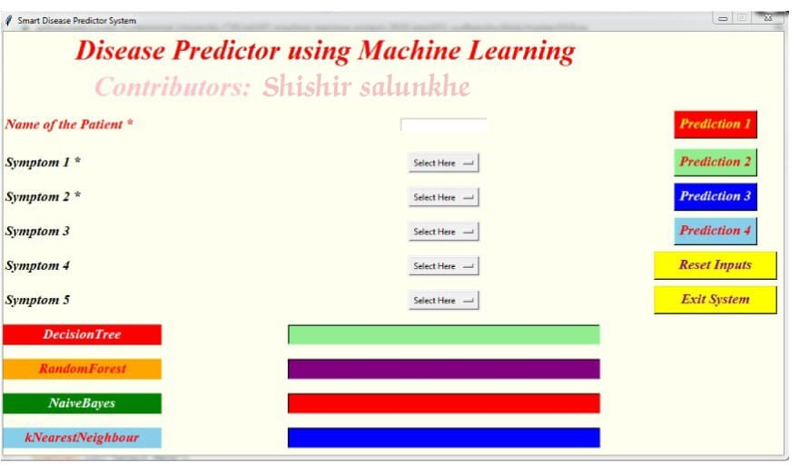

🧑‍⚕️ Disease Prediction using Machine Learning

This project predicts diseases based on user-input symptoms using multiple machine learning algorithms. It provides a GUI interface built with Tkinter and integrates ML models like Decision Tree, Random Forest, Naive Bayes, and K-Nearest Neighbors.

🚀 Features

User-friendly Tkinter GUI for input

Enter patient name and select up to 5 symptoms

Predictions generated using:

Decision Tree

Random Forest

Naive Bayes

K-Nearest Neighbors (KNN)

Multiple predictions displayed for comparison

Buttons to reset inputs and exit system

📊 Algorithms Used

Decision Tree – rule-based classification

Random Forest – ensemble of decision trees

Naive Bayes – probabilistic classifier

K-Nearest Neighbors (KNN) – distance-based classifier

🛠️ Tech Stack

Python

Tkinter (GUI)

Scikit-learn (ML models)

Numpy, Pandas (data processing)

📷 Output

GUI Example:

✨ Contributors

Shishir Salunkhe

📌 Future Improvements

Add deep learning models

Improve GUI with symptom search

Deploy as a web app
