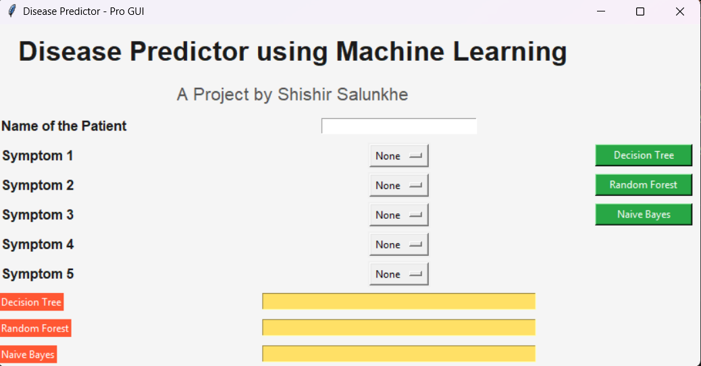

Disease Prediction using Machine Learning
💻 Project Overview

Project Name: Disease Prediction using Machine Learning
Developer: Shishir Salunkhe 
Description:
This project predicts a disease based on the symptoms you select. It uses three machine learning models—Decision Tree, Random Forest, and Naive Bayes—and shows results in a simple Tkinter GUI.

You just select up to 5 symptoms, and the program tells you which disease is most likely.

🧠 Machine Learning Models
1. Decision Tree

Why: Easy to understand and follow.

How: Splits data based on symptoms to find the disease.

2. Random Forest

Why: More accurate than a single decision tree.

How: Makes many trees and combines their results for better predictions.

3. Naive Bayes

Why: Works well with symptoms data (categorical).

How: Calculates the probability of each disease based on the symptoms you select.

🗂️ Dataset

Training Data: Training.csv

Testing Data: Testing.csv

Features: Symptoms (like back_pain, fever, cough)

Target: Disease name

Data Steps:

Remove extra spaces from columns and disease names.

Convert disease names to numbers so ML can understand.

Remove rows with missing disease names.

Only use symptoms that are in the dataset.

🎛️ GUI (Tkinter)

Input: Patient name + select 5 symptoms.

Buttons: Predict using Decision Tree, Random Forest, or Naive Bayes.

Output: Shows the predicted disease.

Colors used:

Background: Light yellow

Labels: Black with yellow text for inputs

Buttons: Green with yellow text

Prediction Output: Orange background with black text

GUI Screenshot:

⚡ How to Use

Install required packages:

pip install pandas numpy scikit-learn

Keep Training.csv, Testing.csv, and the output folder in the same directory as clean_code.py.

Run the Python script:

python clean_code.py

Enter patient name and select symptoms.

Click a button to see which disease is predicted.

## 🎛️ GUI Output

Here is how the Disease Predictor looks when you run it:

📈 Accuracy

The program prints accuracy for each model on the test data in the console.

Random Forest usually gives the best results.

📝 Points

Algorithms: Decision Tree (easy to understand), Random Forest (more accurate), Naive Bayes (handles symptoms well).

Data Handling: Remove empty disease labels, only use existing symptoms.

Prediction: Symptoms are converted to numbers, then models predict the disease.

GUI: Tkinter is used for simple input and output.

Performance: Accuracy is checked with a separate testing dataset.

📁 File Structure
Disease-Prediction-ML/
│
├─ clean_code.py          # Main program with GUI
├─ Training.csv           # Training data
├─ Testing.csv            # Testing data
├─ Output/
│   └─ Screenshot 2025-10-09 122626.png   # GUI Screenshot
└─ README.md              # This file

👨‍💻 Developer

Shishir Salunkhe – Original creator
